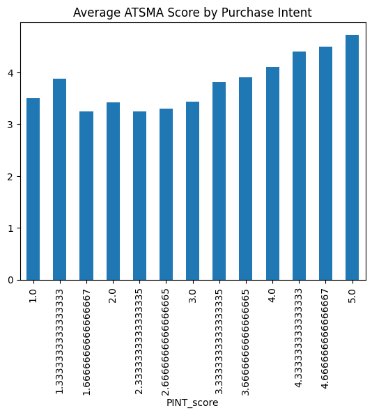
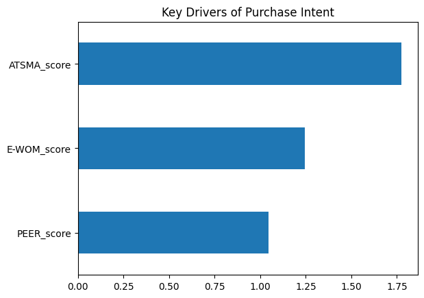
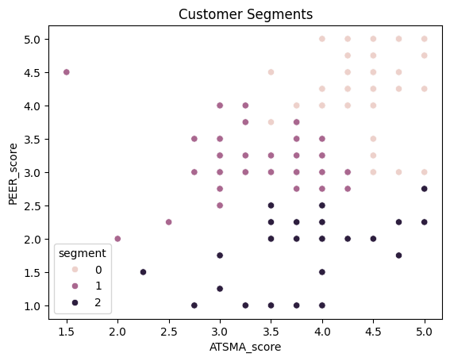

# 🛍️ What Drives Gen Z Fashion Purchases?  
### A Survey-Based Behavioural Analysis

---

## Objective

This project explores a key question:

> **What actually influences Gen Z consumers to purchase fashion products?**

Is it:
- 📱 Social media advertising?
- 👥 Peer influence?
- ⭐ Word-of-mouth (online reviews)?

Using a survey-based dataset, this analysis uncovers the **behavioral drivers behind purchase intention** among Gen Z consumers.

---

## About Dataset

The dataset consists of 180 responses collected using a **Likert scale (1–5)**, where:

- 1 → Strongly Disagree  
- 5 → Strongly Agree  

### Key Constructs:

| Construct | Description |
|----------|------------|
| ATSMA | Attitude Towards Social Media Advertising |
| EWOM | Electronic Word of Mouth (online reviews) |
| PEER | Peer Influence |
| PINT | Purchase Intention (Target Variable) |

Each construct is measured using multiple survey questions (e.g., ATSMA1, ATSMA2, etc.)

---

## Data Processing
### Reliability Check
- Used **Cronbach’s Alpha** to validate internal consistency of survey constructs
- **Cronbach’s Alpha** - It is a measure of how well multiple survey questions work together to measure the same concept

### Feature Engineering
- Grouped survey questions into meaningful constructs  
- Created composite scores using mean aggregation:
  - `ATSMA_score`
  - `EWOM_score`
  - `PEER_score`
  - `PINT_score`

###  Target Variable
- Converted `PINT_score` i.e. 'Purchase Intention' into binary:
  - `1` → Likely to purchase  
  - `0` → Not likely to purchase  

---

## Exploratory Data Analysis(EDA)

- Distribution of purchase intention  
- Feature vs target comparisons  
- Correlation analysis between key variables  
- Behavioural pattern exploration  

---

### Model Used:
- Logistic Regression- Supervised ML algorithm

### Why?
- Focus on **understanding drivers**, not prediction accuracy  
- Extract **feature importance** for business insights  

---

## Key Insights

- **Social media advertising** has the strongest influence on purchase intention  
-  Peer influence plays a role but is less dominant  
-  Word-of-mouth contributes, but not as strongly as expected  
-  Gen Z appears to rely heavily on **digital exposure over personal recommendations**

---

## Customer Segmentation

Used K-Means clustering to identify behavioral groups:

- **Highly Influenced Buyers** → Responsive to all factors  
- **Peer-Driven Buyers** → Strongly influenced by social circles  
- **Independent Buyers** → Less influenced by external factors  

---

## ⚠️ Limitations

The dataset lacks key variables that could improve analysis:

-  Price sensitivity  
-  Discounts and promotions  
-  Sustainability preferences  

These factors are critical in understanding **real purchase behavior vs intent**

---

## Business Recommendations

- Invest in **social media marketing & influencer campaigns**  
- Leverage **user-generated content and reviews**  
- Personalize strategies based on **customer segments**  
- Incorporate pricing and sustainability into future analysis  

---

## 🛠️ Tech Stack

- Python  
- Pandas  
- NumPy  
- Scikit-learn  
- Matplotlib / Seaborn  

---

## Dataset Link
You can access the dataset here:  
[Gen Z Fashion Purchase Dataset]- https://zenodo.org/records/15173942

Dataset provided by:  
- Christian (Contact Person)  
- Ratlan Pardede (Supervisor)  
- Oktafalia Marisa Muzammil (Data Collector)  
- Davy Parsaoran Hinsa (Data Collector)

---
